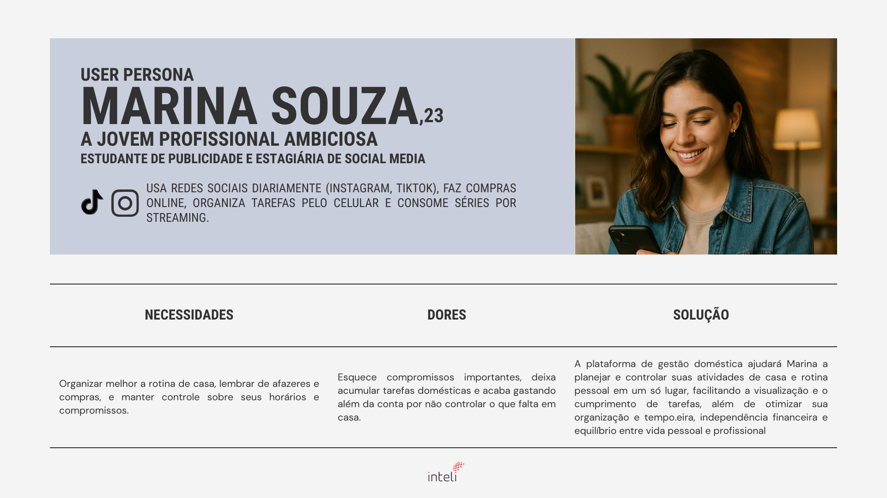
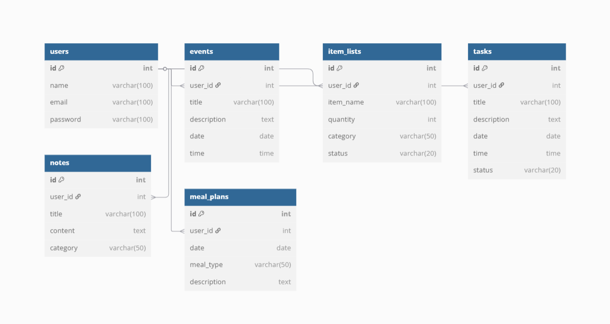

# Web Application Document - Projeto Individual - Módulo 2 - Inteli

## 🏠 SoloLife

**Plataforma de Gestão Doméstica para Jovens que Moram Sozinhos**

#### Autor do projeto

**Autor:** [Vivian de Assis Peres](https://www.linkedin.com/in/vivianperesinteli/)

## Sumário

1. [Introdução](#c1)  
2. [Visão Geral da Aplicação Web](#c2)  
3. [Projeto Técnico da Aplicação Web](#c3)  
4. [Desenvolvimento da Aplicação Web](#c4)  
5. [Referências](#c5)  

 

## 1. Introdução (Semana 01)

A proposta deste projeto é desenvolver uma plataforma web voltada para jovens adultos que moram sozinhos e desejam organizar melhor sua rotina doméstica e pessoal. A aplicação permitirá o cadastro e gerenciamento de tarefas domésticas, controle de listas de compras, anotações pessoais e organização de eventos e compromissos.

Com foco em otimizar o tempo e melhorar a qualidade de vida do usuário, a plataforma busca reduzir esquecimentos, acúmulo de tarefas e desorganização, oferecendo uma interface prática e intuitiva para o controle do dia a dia.

---

## 2. Visão Geral da Aplicação Web

### 2.1. Personas (Semana 01 - opcional)

#### Persona

**Nome:** Marina Souza  
**Idade:** 23 anos  
**Ocupação:** Estudante de Publicidade e Estagiária de Social Media  
**Hábitos digitais:** Utiliza redes sociais diariamente (Instagram, TikTok), realiza compras online, organiza tarefas pelo celular e consome séries por streaming.  
**Necessidades:** Organizar melhor a rotina de casa, lembrar de afazeres e compras, manter controle sobre seus horários e compromissos.  
**Dores:** Esquece compromissos importantes, acumula tarefas domésticas e ultrapassa o orçamento por falta de controle do que precisa comprar.  
**Solução:** A plataforma de gestão doméstica permitirá a Marina planejar e acompanhar suas atividades domésticas e pessoais em um só lugar, ajudando a evitar esquecimentos, melhorar a organização e otimizar seu tempo.

**Imagem da Persona:**  

---

### 2.2. User Stories (Semana 01 - opcional)

**US01**  
Como **jovem que mora sozinha**, quero **criar e organizar tarefas domésticas com datas e horários**, para que **eu possa manter a casa em ordem e não esquecer compromissos importantes**.

**US02**  
Como **usuária da plataforma**, quero **adicionar itens a uma lista de compras compartilhável**, para que **eu saiba o que falta em casa e possa organizar as compras de forma prática**.

**US03**  
Como **jovem universitária com rotina agitada**, quero **registrar anotações pessoais e ideias rápidas no app**, para que **eu possa organizar meus pensamentos e não esquecer de coisas importantes do dia a dia**.

#### Análise INVEST da US01

| Critério | Justificativa |
|:------------|:----------------------------------------------------------------|
| **I – Independente** | Pode ser desenvolvida de forma isolada, sem depender de outras funcionalidades. |
| **N – Negociável** | Pode ser ajustada (por exemplo, incluir categorias de tarefas ou definir prioridades). |
| **V – Valiosa** | Atende diretamente à necessidade do público-alvo, organizando a rotina e evitando esquecimentos. |
| **E – Estimável** | É possível estimar o tempo e esforço necessários para implementá-la (ex.: 3 story points ou 1 sprint). |
| **S – Small** | Tem escopo limitado, envolvendo cadastro, edição e visualização de tarefas com data e hora. |
| **T – Testável** | Pode ser validada criando tarefas, editando, excluindo e conferindo o agendamento correto. |

---

## 3. Projeto da Aplicação Web

### 3.1. Modelagem do banco de dados  (Semana 3)

*Fonte: Produzido pelo autor do projeto por meio do Supabase (2025).

![📜 Modelagem Física com Schema do Banco de Dados - Scripts SQL]
CREATE TABLE users (
  id INT PRIMARY KEY AUTO_INCREMENT,
  name VARCHAR(100),
  email VARCHAR(100) UNIQUE,
  password VARCHAR(100)
);

CREATE TABLE events (
  id INT PRIMARY KEY AUTO_INCREMENT,
  user_id INT,
  title VARCHAR(100),
  description TEXT,
  date DATE,
  time TIME,
  FOREIGN KEY (user_id) REFERENCES users(id)
);

CREATE TABLE item_lists (
  id INT PRIMARY KEY AUTO_INCREMENT,
  user_id INT,
  item_name VARCHAR(100),
  quantity INT,
  category VARCHAR(50),
  status VARCHAR(20),
  FOREIGN KEY (user_id) REFERENCES users(id)
);

CREATE TABLE tasks (
  id INT PRIMARY KEY AUTO_INCREMENT,
  user_id INT,
  title VARCHAR(100),
  description TEXT,
  date DATE,
  time TIME,
  status VARCHAR(20),
  FOREIGN KEY (user_id) REFERENCES users(id)
);

CREATE TABLE notes (
  id INT PRIMARY KEY AUTO_INCREMENT,
  user_id INT,
  title VARCHAR(100),
  content TEXT,
  category VARCHAR(50),
  FOREIGN KEY (user_id) REFERENCES users(id)
);

CREATE TABLE meal_plans (
  id INT PRIMARY KEY AUTO_INCREMENT,
  user_id INT,
  date DATE,
  meal_type VARCHAR(50),
  description TEXT,
  FOREIGN KEY (user_id) REFERENCES users(id)
);

### 3.1.1 BD e Models (Semana 5)
*Descreva aqui os Models implementados no sistema web*

### 3.2. Arquitetura (Semana 5)

*Posicione aqui o diagrama de arquitetura da sua solução de aplicação web. Atualize sempre que necessário.*

**Instruções para criação do diagrama de arquitetura**  
- **Model**: A camada que lida com a lógica de negócios e interage com o banco de dados.
- **View**: A camada responsável pela interface de usuário.
- **Controller**: A camada que recebe as requisições, processa as ações e atualiza o modelo e a visualização.
  
*Adicione as setas e explicações sobre como os dados fluem entre o Model, Controller e View.*

### 3.3. Wireframes (Semana 03 - opcional)

*Posicione aqui as imagens do wireframe construído para sua solução e, opcionalmente, o link para acesso (mantenha o link sempre público para visualização).*

### 3.4. Guia de estilos (Semana 05 - opcional)

*Descreva aqui orientações gerais para o leitor sobre como utilizar os componentes do guia de estilos de sua solução.*

### 3.5. Protótipo de alta fidelidade (Semana 05 - opcional)

*Posicione aqui algumas imagens demonstrativas de seu protótipo de alta fidelidade e o link para acesso ao protótipo completo (mantenha o link sempre público para visualização).*

### 3.6. WebAPI e endpoints (Semana 05)

*Utilize um link para outra página de documentação contendo a descrição completa de cada endpoint. Ou descreva aqui cada endpoint criado para seu sistema.*  

### 3.7 Interface e Navegação (Semana 07)

*Descreva e ilustre aqui o desenvolvimento do frontend do sistema web, explicando brevemente o que foi entregue em termos de código e sistema. Utilize prints de tela para ilustrar.*

---

## 4. Desenvolvimento da Aplicação Web (Semana 8)

### 4.1 Demonstração do Sistema Web (Semana 8)

*VIDEO: Insira o link do vídeo demonstrativo nesta seção*
*Descreva e ilustre aqui o desenvolvimento do sistema web completo, explicando brevemente o que foi entregue em termos de código e sistema. Utilize prints de tela para ilustrar.*

### 4.2 Conclusões e Trabalhos Futuros (Semana 8)

*Indique pontos fortes e pontos a melhorar de maneira geral.*
*Relacione também quaisquer outras ideias que você tenha para melhorias futuras.*

## 5. Referências

_Incluir as principais referências de seu projeto, para que o leitor possa consultar caso ele se interessar em aprofundar._ 

---
---
